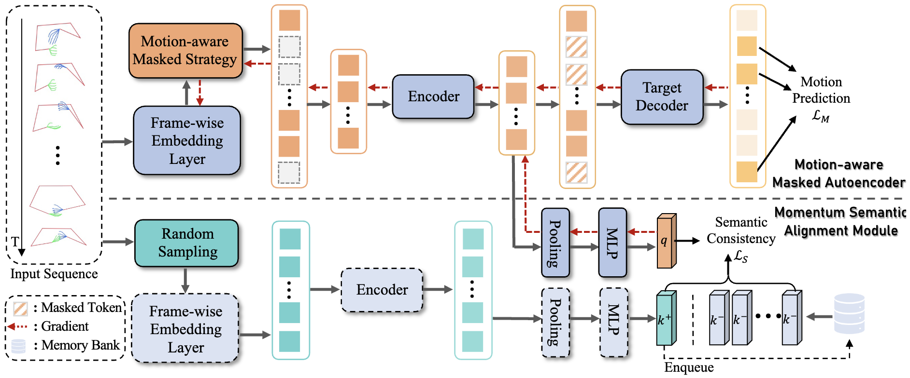

# MASA: Motion-aware Masked Autoencoder with Semantic Alignment for Sign Language Recognition
[Weichao Zhao](https://scholar.google.com/citations?user=v-ASmMIAAAAJ&hl=zh-CN), [Hezhen Hu](https://scholar.google.com/citations?user=Fff-9WAAAAAJ&hl=zh-CN&oi=ao), [Wengang Zhou](https://scholar.google.com/citations?user=8s1JF8YAAAAJ&hl=zh-CN&oi=ao), [Yunyao Mao](https://scholar.google.com/citations?user=uQJ7Df0AAAAJ&hl=en), [Min Wang](https://scholar.google.com/citations?user=FFDionEAAAAJ&hl=zh-CN&oi=ao) and [Houqiang Li](https://scholar.google.com/citations?user=7sFMIKoAAAAJ&hl=zh-CN&oi=ao)

This repository includes Python (PyTorch) implementation of this paper.

Accepted by TCSVT2024




## Requirements

```bash
python==3.8.13
torch==1.8.1+cu111
torchvision==0.9.1+cu111
tensorboard==2.9.0
scikit-learn==1.1.1
tqdm==4.64.0
numpy==1.22.4
```

## Pre-Training
Please refer to the bash scripts

## Datasets
* Download the original datasets, including [SLR500](https://ustc-slr.github.io/datasets/), [NMFs_CSL](https://ustc-slr.github.io/datasets/), [WLASL](https://dxli94.github.io/WLASL/) and [MSASL](https://www.microsoft.com/en-us/research/project/ms-asl/)

* Utilize the off-the-shelf pose estimator [MMPose](https://mmpose.readthedocs.io/en/latest/model_zoo/wholebody_2d_keypoint.html) with the setting of [Topdown Heatmap + Hrnet + Dark on Coco-Wholebody](https://download.openmmlab.com/mmpose/top_down/hrnet/hrnet_w48_coco_wholebody_384x288_dark-f5726563_20200918.pth) to extract the 2D keypoints for sign language videos.
* The final data is formatted as follows:
  
```
    Data
    ├── NMFs_CSL
    ├── SLR500
    ├── WLASL
    └── MSASL
        ├── Video
        ├── Pose
        └── Annotations
```

## Pretrained Model
You can download the pretrained model from this link: [pretrained model on four ISLR datasets](https://rec.ustc.edu.cn/share/d8766290-0475-11ef-a181-0b1056e2faed)

## Citation
If you find this work useful for your research, please consider citing our work:
```
@article{zhao2024masa,
  title={MASA: Motion-aware Masked Autoencoder with Semantic Alignment for Sign Language Recognition},
  author={Zhao, Weichao and Hu, Hezhen and Zhou, Wengang and Mao, Yunyao and Wang, Min and Li, Houqiang},
  journal={arXiv},
  year={2024}
}
```